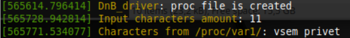

# Лабораторная работа 1

**Название:** "Разработка драйверов символьных устройств"

**Цель работы:** ...

## Описание функциональности драйвера

...

## Инструкция по сборке

```shell
make all
```

## Инструкция пользователя

Загружаем драйвер
```shell
sudo insmod DnB_driver.ko
```

Выгружаем драйвер
```shell
sudo rmmod DnB_driver.ko
```


## Примеры использования
Загружаем строку
```shell
echo "vsem privet" >> /proc/var1
```

Читаем
```shell
cat /proc/var1
>> vsem privet
```

dmesg:
